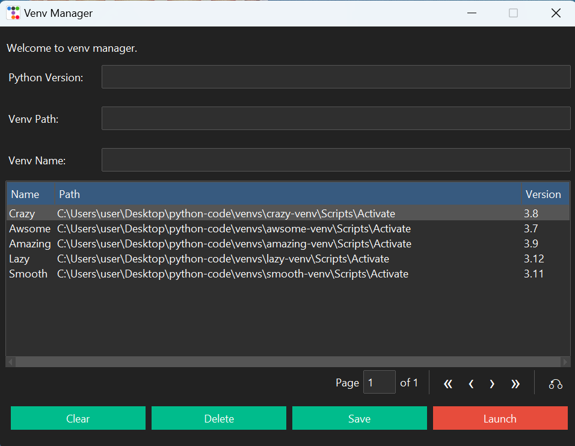

#  ttkbootstrap : venv manager
This program goal is to allow the user activate a python **venv** in a new cmd window.

</img>

The user can add a new venv activate path or delete one from the list.<br>
To be able to activate a venv in a new cmd window the user need to enter the correct path to venv **activate** script. 

**Make sure to enter a full path** for example:

```console
c:\venvs\gui-venv\Scripts\Activate
```

How to use:
```console
git https://github.com/ip-repo/python.git
python -m venv venv-manager-venv
venv-manager-venv\scripts\activate
pip install ttkbootstrap
cd venv-manager
python venv_manager.py
```
**Make sure that the file venv_list.txt is in the same directory as the python file or make sure to change to the path in VenvManager __init__ : self.venvs_list_file = your path **
